```{r, include = FALSE}
knitr::opts_chunk$set(
  collapse = TRUE,
  comment = "#>"
)
set.seed(123)
```

```{r setup}
library(openxlsx2)
```

```{r}
wb <- wb_workbook()
wb$add_dxfs_style(name = "negStyle", font_color = wb_color(hex = "#FF9C0006"), bg_fill = wb_color(hex = "#FFFFC7CE"))
wb$add_dxfs_style(name = "posStyle", font_color = wb_color(hex = "#FF006100"), bg_fill = wb_color(hex = "#FFC6EFCE"))
```

## Rule applies to all each cell in range

```{r echo=FALSE, warning=FALSE}
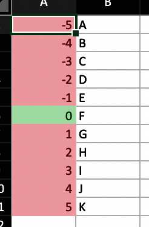
```

```{r}
wb$add_worksheet("cellIs")
wb$add_data("cellIs", -5:5)
wb$add_data("cellIs", LETTERS[1:11], start_col = 2)
wb$add_conditional_formatting(
  "cellIs",
  dims = "A1:A11",
  rule = "!=0",
  style = "negStyle"
)
wb$add_conditional_formatting(
  "cellIs",
  dims = "A1:A11",
  rule = "==0",
  style = "posStyle"
)
```

## Highlight row dependent on first cell in row

```{r echo = FALSE, warning = FALSE}
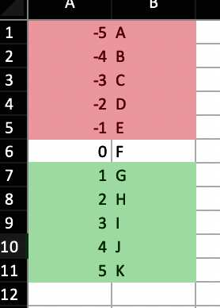
```

```{r}
wb$add_worksheet("Moving Row")
wb$add_data("Moving Row", -5:5)
wb$add_data("Moving Row", LETTERS[1:11], start_col = 2)
wb$add_conditional_formatting(
  "Moving Row",
  dims = "A1:B11",
  rule = "$A1<0",
  style = "negStyle"
)
wb$add_conditional_formatting(
  "Moving Row",
  dims = "A1:B11",
  rule = "$A1>0",
  style = "posStyle"
)
```

## Highlight column dependent on first cell in column

```{r echo=FALSE, warning=FALSE}
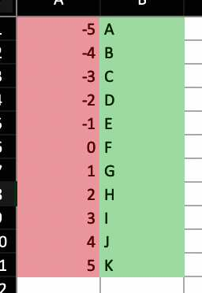
```

```{r}
wb$add_worksheet("Moving Col")
wb$add_data("Moving Col", -5:5)
wb$add_data("Moving Col", LETTERS[1:11], start_col = 2)
wb$add_conditional_formatting(
  "Moving Col",
  dims = "A1:B11",
  rule = "A$1<0",
  style = "negStyle"
)
wb$add_conditional_formatting(
  "Moving Col",
  dims = "A1:B11",
  rule = "A$1>0",
  style = "posStyle"
)
```

## Highlight entire range cols X rows dependent only on cell A1

```{r echo = FALSE, warning = FALSE}
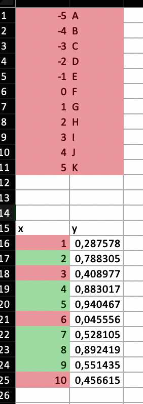
```

```{r}
wb$add_worksheet("Dependent on")
wb$add_data("Dependent on", -5:5)
wb$add_data("Dependent on", LETTERS[1:11], start_col = 2)
wb$add_conditional_formatting(
  "Dependent on",
  dims = "A1:B11",
  rule = "$A$1 < 0",
  style = "negStyle"
)
wb$add_conditional_formatting(
  "Dependent on",
  dims = "A1:B11",
  rule = "$A$1>0",
  style = "posStyle"
)
```

## Highlight cells in column 1 based on value in column 2

```{r}
wb$add_data("Dependent on", data.frame(x = 1:10, y = runif(10)), startRow = 15)
wb$add_conditional_formatting(
  "Dependent on",
  dims = "A16:A25",
  rule = "B16<0.5",
  style = "negStyle"
)
wb$add_conditional_formatting(
  "Dependent on",
  dims = "A16:A25",
  rule = "B16>=0.5",
  style = "posStyle"
)
```

## Highlight duplicates using default style

```{r echo=FALSE, warning=FALSE}
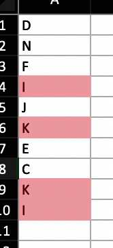
```

```{r}
wb$add_worksheet("Duplicates")
wb$add_data("Duplicates", sample(LETTERS[1:15], size = 10, replace = TRUE))
wb$add_conditional_formatting(
  "Duplicates",
  dims = "A1:A10",
  type = "duplicatedValues"
)
```

## Cells containing text

```{r echo=FALSE, warning=FALSE}
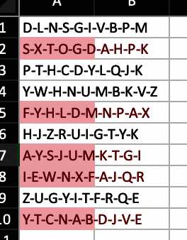
```

```{r}
fn <- function(x) paste(sample(LETTERS, 10), collapse = "-")
wb$add_worksheet("containsText")
wb$add_data("containsText", sapply(1:10, fn))
wb$add_conditional_formatting(
  "containsText",
  dims = "A1:A10",
  type = "containsText",
  rule = "A"
)
```

## Cells not containing text

```{r echo=FALSE, warning=FALSE}
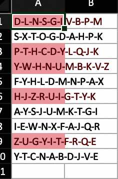
```

```{r}
fn <- function(x) paste(sample(LETTERS, 10), collapse = "-")
my_dat <- sapply(1:10, fn)

wb$add_worksheet("notcontainsText")
wb$add_data("notcontainsText", x = my_dat)
wb$add_conditional_formatting(
  "notcontainsText",
  dims = wb_dims(x = my_dat),
  type = "notContainsText",
  rule = "A"
)
```

## Cells begins with text

```{r echo=FALSE, warning=FALSE}
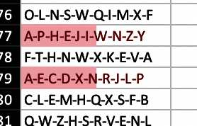
```

```{r}
fn <- function(x) paste(sample(LETTERS, 10), collapse = "-")
wb$add_worksheet("beginsWith")
wb$add_data("beginsWith", sapply(1:100, fn))
wb$add_conditional_formatting(
  "beginsWith",
  dims = "A1:A100",
  type = "beginsWith",
  rule = "A"
)
```

## Cells ends with text

```{r echo=FALSE, warning=FALSE}
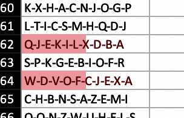
```

```{r}
fn <- function(x) paste(sample(LETTERS, 10), collapse = "-")
wb$add_worksheet("endsWith")
wb$add_data("endsWith", x = sapply(1:100, fn))
wb$add_conditional_formatting(
  "endsWith",
  dims = "A1:A100",
  type = "endsWith",
  rule = "A"
)
```

## Colorscale colors cells based on cell value

```{r echo=FALSE, warning=FALSE, out.width="100%", fig.cap="Yep, that is a color scale image."}

```

```{r}
df <- read_xlsx("https://github.com/JanMarvin/openxlsx-data/raw/main/readTest.xlsx", sheet = 5)
wb$add_worksheet("colorScale", zoom = 30)
wb$add_data(x = df, col_names = FALSE) ## write data.frame
```

Rule is a vector or colors of length 2 or 3 (any hex color or any of `colors()`).
If rule is `NULL`, min and max of cells is used. Rule must be the same length as style or L.

```{r}
wb$add_conditional_formatting(
  sheet = "colorScale",
  dims = wb_dims(
    rows = seq_len(nrow(df)),
    cols = seq_len(ncol(df))
    ),
  # dims = wb_dims(x = df, col_names = FALSE, select = "data")
  style = c("black", "white"),
  rule = c(0, 255),
  type = "colorScale"
)
wb$set_col_widths("colorScale", cols = seq_along(df), widths = 1.07)
wb$set_row_heights("colorScale", rows = seq_len(nrow(df)), heights = 7.5)
```


## Databars

```{r echo=FALSE, warning=FALSE, out.width="100%"}
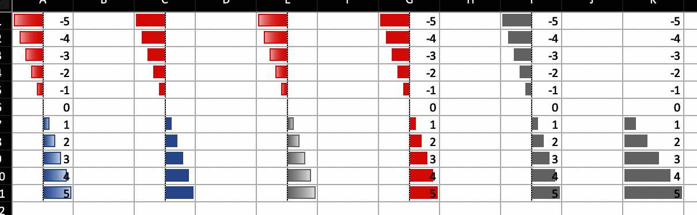
```

```{r}
wb$add_worksheet("databar")
## Databars
wb$add_data("databar", -5:5, start_col = 1)
wb <- wb_add_conditional_formatting(
  wb,
  "databar",
  dims = "A1:A11",
  type = "dataBar"
) ## Default colors

wb$add_data("databar", -5:5, start_col = 3)
wb <- wb_add_conditional_formatting(
  wb,
  "databar",
  dims = "C1:C11",
  type = "dataBar",
  params = list(
    showValue = FALSE,
    gradient = FALSE
  )
) ## Default colors

wb$add_data("databar", -5:5, start_col = 5)
wb <- wb_add_conditional_formatting(
  wb,
  sheet = "databar",
  dims = "E1:E11",
  type = "dataBar",
  style = c("#a6a6a6"),
  params = list(showValue = FALSE)
)

wb$add_data("databar", -5:5, start_col = 7)
wb <- wb_add_conditional_formatting(
  wb,
  "databar",
  dims = "G1:G11",
  type = "dataBar",
  style = c("red"),
  params = list(
    showValue = TRUE,
    gradient = FALSE
  )
)

# custom color
wb$add_data("databar", -5:5, start_col = 9)
wb <- wb_add_conditional_formatting(
  wb,
  "databar",
  dims = wb_dims(rows = 1:11, cols = 9),
  type = "dataBar",
  style = c("#a6a6a6", "#a6a6a6"),
  params = list(showValue = TRUE, gradient = FALSE)
)

# with rule
wb$add_data(x = -5:5, start_col = 11)
wb <- wb_add_conditional_formatting(
  wb,
  "databar",
  dims = wb_dims(rows = 1:11, cols = 11),
  type = "dataBar",
  rule = c(0, 5),
  style = c("#a6a6a6", "#a6a6a6"),
  params = list(showValue = TRUE, gradient = FALSE)
)
```

## Between

```{r echo=FALSE, warning=FALSE}
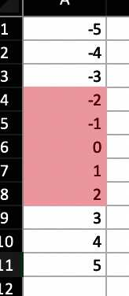
```

Highlight cells in interval [-2, 2]

```{r}
wb$add_worksheet("between")
wb$add_data("between", -5:5)
wb$add_conditional_formatting(
  "between",
  dims = wb_dims(rows = 2:11, cols = 1),
  type = "between",
  rule = c(-2, 2)
)
wb$add_worksheet("topN")
```

## Top N

```{r echo=FALSE, warning=FALSE}
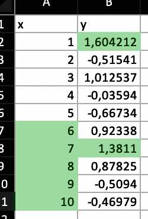
```

```{r}
wb$add_data("topN", data.frame(x = 1:10, y = rnorm(10)))
```

Highlight top 5 values in column `x`

```{r}
wb$add_conditional_formatting(
  "topN",
  dims = wb_dims(rows = 2:11, cols = 1),
  style = "posStyle",
  type = "topN",
  params = list(rank = 5)
)
```

Highlight top 20 percentage in column `y`

```{r}
wb$add_conditional_formatting(
  "topN",
  dims = wb_dims(rows = 2:11, cols = 2),
  style = "posStyle",
  type = "topN",
  params = list(rank = 20, percent = TRUE)
)
wb$add_worksheet("bottomN")
```

## Bottom N

```{r echo=FALSE, warning=FALSE}
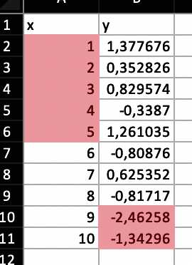
```

```{r}
wb$add_data("bottomN", data.frame(x = 1:10, y = rnorm(10)))
```

Highlight bottom 5 values in column `x`

```{r}
wb$add_conditional_formatting(
  "bottomN",
  dims = wb_dims(rows = 2:11, cols = 1),
  style = "negStyle",
  type = "bottomN",
  params = list(rank = 5)
)
```

Highlight bottom 20 percentage in column y

```{r}
wb$add_conditional_formatting(
  "bottomN",
  cols = 2,
  rows = 2:11,
  style = "negStyle",
  type = "bottomN",
  params = list(rank = 20, percent = TRUE)
)
wb$add_worksheet("logical operators")
```

## Logical Operators

```{r echo=FALSE, warning=FALSE}
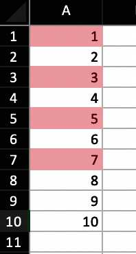
```

You can use Excels logical Operators

```{r}
wb$add_data("logical operators", 1:10)
wb$add_conditional_formatting(
  "logical operators",
  dims = wb_dims(rows = 1:10, cols = 1),
  rule = "OR($A1=1,$A1=3,$A1=5,$A1=7)"
)
```
