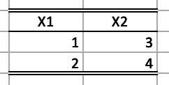
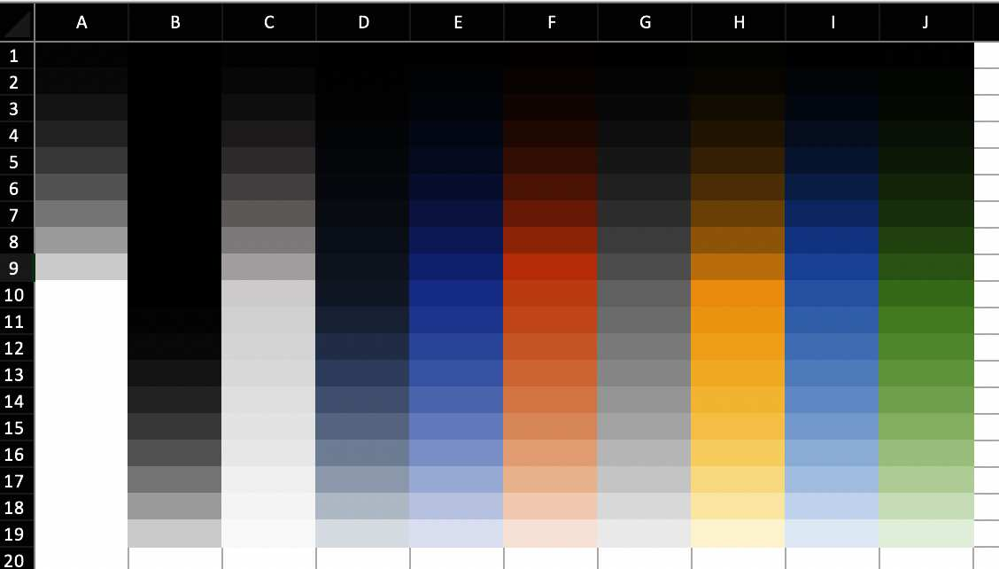

```{r setup, include = FALSE}
options(rmarkdown.html_vignette.check_title = FALSE)
knitr::opts_chunk$set(
  collapse = TRUE,
  comment = "#>"
)

# Mechanism to avoid including all images in the package, but display them on
# the pkgdown site
in_pkgdown <- function() {
  identical(Sys.getenv("IN_PKGDOWN"), "true")
}

incl_graph_in_pkgdown <- function(path) {
  if (in_pkgdown()) {
    knitr::include_graphics(path)
  }
}
```

```{asis, echo=!in_pkgdown()}
You can read the [styling vignette](https://janmarvin.github.io/openxlsx2/articles/openxlsx2_style_manual.html) online to see images.
```


Welcome to the styling manual for `openxlsx2`. In this manual you will learn how to use `openxlsx2` to style your worksheets. data from xlsx-files to R as well as how to export data from R to xlsx, and how to import and modify these `openxml` workbooks in R.

```{r}
library(openxlsx2)
```

# Styling showcase

## Colors, text rotation and number formats

Below we show you two ways how to create styled tables with `openxlsx2` one using the high level functions to style worksheet areas and one using the bare metal approach of creating the identical table. We show both ways to create styles in `openxlsx2` to show how you could build on our functions or create your very own functions.

```{r echo=FALSE, warning=FALSE, out.width="100%", fig.cap="The example below, with increased column width."}
incl_graph_in_pkgdown("img/worksheet_styling.jpg")
```

### the quick way: using high level functions

```{r}
# add some dummy data
set.seed(123)
random_numbers <- 44444 + seq(-555, 555, length.out = 28 * 28)
mat <- matrix(random_numbers, ncol = 28)
colnames(mat) <- make.names(seq_len(ncol(mat)))
border_col <- wb_color(theme = 1)
border_sty <- "thin"

# using ) to avoid counting manually which `dims` are spanned.
dims_mat_header <- wb_dims(rows = 1, cols = seq_len(ncol(mat)))
# returns "A1:AB1"
# prepare workbook with data and formated first row
wb <- wb_workbook()$
  add_worksheet("test")$
  add_data(x = mat)$
  add_border(dims = dims_mat_header,
    top_color = border_col, top_border = border_sty,
    bottom_color = border_col, bottom_border = border_sty,
    left_color = border_col, left_border = border_sty,
    right_color = border_col, right_border = border_sty,
    inner_hcolor = border_col, inner_hgrid = border_sty
  )$
  add_fill(dims = dims_mat_header, color = wb_color(hex = "FF334E6F"))$
  add_font(dims = dims_mat_header, name = "Arial", bold = TRUE, color = wb_color("white"), size = 20)$
  add_cell_style(dims = dims_mat_header, horizontal = "center", textRotation = 45)

# create various number formats
x <- c(
  0, 1, 2, 3, 4, 9, 10, 11, 12, 13, 14, 15, 16, 17, 18, 19, 20, 21, 22,
  37, 38, 39, 40, 45, 46, 47, 48, 49
)

# apply the styles
for (i in seq_along(x)) {
  cell <- sprintf("%s2:%s29", int2col(i), int2col(i))
  wb$add_numfmt(dims = cell, numfmt = x[i])
}

# wb$open()
```

### the long way: using bare metal functions

```{r}
# create workbook
wb <- wb_workbook()$add_worksheet("test")

# add some dummy data to the worksheet
set.seed(123)
random_numbers <- 44444 + seq(-555, 555, length.out = 28 * 28)
mat <- matrix(random_numbers, ncol = 28)
colnames(mat) <- make.names(seq_len(ncol(mat)))
wb$add_data(x = mat, col_names = TRUE)

# create a border style and assign it to the workbook
black <- wb_color("black")
# same as wb_color("black") or  wb_color(hex = "FF000000") or wb_color("FF000000")
new_border <- create_border(
  bottom = "thin", bottom_color = black,
  top = "thin", top_color = black,
  left = "thin", left_color = black,
  right = "thin", right_color = black
)
wb$styles_mgr$add(new_border, "new_border")


# create a fill style and assign it to the workbook
new_fill <- create_fill(pattern_type = "solid", fg_color = wb_color(hex = "FF334E6F"))
wb$styles_mgr$add(new_fill, "new_fill")

# create a font style and assign it to the workbook
new_font <- create_font(sz = 20, name = "Arial", b = TRUE, color = wb_color("white"))
wb$styles_mgr$add(new_font, "new_font")

# create a new cell style, that uses the fill, the font and the border style
new_cellxfs <- create_cell_style(
  num_fmt_id = 0,
  horizontal = "center",
  text_rotation = 45,
  fill_id = wb$styles_mgr$get_fill_id("new_fill"),
  font_id = wb$styles_mgr$get_font_id("new_font"),
  border_id = wb$styles_mgr$get_border_id("new_border")
)
# assign this style to the workbook
wb$styles_mgr$add(new_cellxfs, "new_styles")

# assign the new cell style to the header row of our data set
# Achieve the same with `wb_dims()` and sprintf
# cell <- sprintf("A1:%s1", int2col(nrow(mat)))
cell <- wb_dims(rows = 1, cols = seq_len(ncol(mat)))
wb$set_cell_style(
  dims = cell,
  style = wb$styles_mgr$get_xf_id("new_styles")
)

## style the cells with some builtin format codes (no new numFmt entry is needed)
# add builtin style ids
x <- c(
  1, 2, 3, 4, 9, 10, 11, 12, 13, 14, 15, 16, 17, 18, 19, 20, 21, 22,
  37, 38, 39, 40, 45, 46, 47, 48, 49
)

# create styles
new_cellxfs <- create_cell_style(num_fmt_id = x, horizontal = "center")

# assign the styles to the workbook
for (i in seq_along(x)) {
  wb$styles_mgr$add(new_cellxfs[i], paste0("new_style", i))
}

# new styles are 1:28
new_styles <- wb$styles_mgr$get_xf()
for (i in as.integer(new_styles$id[new_styles$name %in% paste0("new_style", seq_along(x))])) {
  cell <- wb_dims(rows = seq_len(nrow(mat)), cols = i, from_row = 2)
  wb$set_cell_style(dims = cell, style = i)
}

# assign a custom tabColor
wb$worksheets[[1]]$sheetPr <- xml_node_create(
  "sheetPr",
  xml_children = xml_node_create(
    "tabColor",
    xml_attributes = wb_color(hex = "FF00FF00")
  )
)

# # look at the beauty you've created
# wb_open(wb)
```

# Working with number formats

By default, `openxlsx2` will pick up number formats for selected R classes.

## numfmts
```{r}
## Create Workbook object and add worksheets
wb <- wb_workbook()
wb$add_worksheet("S1")
wb$add_worksheet("S2")

df <- data.frame(
  "Date" = Sys.Date() - 0:19,
  "T" = TRUE,
  "F" = FALSE,
  "Time" = Sys.time() - 0:19 * 60 * 60,
  "Cash" = 1:20, "Cash2" = 31:50,
  "hLink" = "https://CRAN.R-project.org/",
  "Percentage" = seq(0, 1, length.out = 20),
  "TinyNumbers" = runif(20) / 1E9, stringsAsFactors = FALSE
)

## openxlsx will apply default spreadsheet styling for these classes
class(df$Cash) <- c(class(df$Cash), "currency")
class(df$Cash2) <- c(class(df$Cash2), "accounting")
class(df$hLink) <- "hyperlink"
class(df$Percentage) <- c(class(df$Percentage), "percentage")
class(df$TinyNumbers) <- c(class(df$TinyNumbers), "scientific")

wb$add_data("S1", x = df, start_row = 4, row_names = FALSE)
wb$add_data_table("S2", x = df, start_row = 4, row_names = FALSE)
```


## numfmts2

In addition, you can set the style to be picked up using `openxlsx2` options.

```{r}
wb <- wb_workbook()$add_worksheet("test")

options("openxlsx2.dateFormat" = "yyyy")
options("openxlsx2.datetimeFormat" = "yyyy-mm-dd")
options("openxlsx2.numFmt" = "€ #.0")

df <- data.frame(
  "Date" = Sys.Date() - 0:19,
  "T" = TRUE, "F" = FALSE,
  "Time" = Sys.time() - 0:19 * 60 * 60,
  "Cash" = 1:20, "Cash2" = 31:50,
  "hLink" = "https://CRAN.R-project.org/",
  "Percentage" = seq(0, 1, length.out = 20),
  "TinyNumbers" = runif(20) / 1E9, stringsAsFactors = FALSE,
  "numeric" = 1
)

## openxlsx will apply default spreadsheet styling for these classes
class(df$Cash) <- c(class(df$Cash), "currency")
class(df$Cash2) <- c(class(df$Cash2), "accounting")
class(df$hLink) <- "hyperlink"
class(df$Percentage) <- c(class(df$Percentage), "percentage")
class(df$TinyNumbers) <- c(class(df$TinyNumbers), "scientific")

wb$add_data("test", df)
```

```{r include=FALSE}
# cleanup
options("openxlsx2.numFmt" = NULL)
```

# Modifying the column widths

## wb_set_col_widths
```{r}
wb <- wb_workbook()$
  add_worksheet()$
  add_data(x = mtcars, row_names = TRUE)

cols <- 1:12
wb$set_col_widths(cols = cols, widths = "auto")
```

# Adding borders

## add borders
```{r}
wb <- wb_workbook()$
# full inner grid
  add_worksheet(sheet = "S1", grid_lines = FALSE)$
  add_data(x = mtcars)$
  add_border(
    dims = "A2:K33", # can use wb_dims(rows = 2:33, cols = ncol(mtcars))
    inner_hgrid = "thin",
    inner_hcolor = wb_color(hex = "FF808080"),
    inner_vgrid = "thin",
    inner_vcolor = wb_color(hex = "FF808080")
  )$
# only horizontal grid
  add_worksheet("S2", grid_lines = FALSE)$
  add_data(x = mtcars)$
  add_border(
  dims = "A2:K33",
  inner_hgrid = "thin",
  inner_hcolor = wb_color(hex = "FF808080")
  )$
# only vertical grid
  add_worksheet("S3", grid_lines = FALSE)$
  add_data(x = mtcars)$
  add_border(
  dims = "A2:K33",
  inner_vgrid = "thin",
  inner_vcolor = wb_color(hex = "FF808080")
  )$
# no inner grid
  add_worksheet("S4", grid_lines = FALSE)$add_data(x = mtcars)$
  add_border("S4", dims = "A2:K33")
# wb_open(wb)
```


## styled table

Below we show you two ways how to create styled tables with `openxlsx2` one using the high level functions to style worksheet areas and one using the bare metal approach of creating the identical table.

```{r echo=FALSE, warning=FALSE, fig.cap="Tiny table with minimal styling"}

```

### the quick way: using high level functions
```{r}
# add some dummy data to the worksheet
mat <- matrix(1:4, ncol = 2, nrow = 2)
colnames(mat) <- make.names(seq_len(ncol(mat)))

wb <- wb_workbook()$
  add_worksheet("test")$
  add_data(x = mat, dims = wb_dims(from_dims = "B2"))$
  # center first row
  add_cell_style(dims = "B2:C2", horizontal = "center")$
  # add border for first row
  add_border(
    dims = "B2:C2",
    bottom_color = wb_color(theme = 1), bottom_border = "thin",
    top_color = wb_color(theme = 1), top_border = "double",
    left_border = NULL, right_border = NULL
  )$
  # add border for last row
  add_border(
    dims = "B4:C4",
    bottom_color = wb_color(theme = 1), bottom_border = "double",
    top_border = NULL, left_border = NULL, right_border = NULL
  )
```

### the long way: creating everything from the bone
```{r}
# add some dummy data to the worksheet
mat <- matrix(1:4, ncol = 2, nrow = 2)
colnames(mat) <- make.names(seq_len(ncol(mat)))

wb <- wb_workbook()$
  add_worksheet("test")$
  add_data(
    x = mat,
    dims = wb_dims(2, 2)
  )

# create a border style and assign it to the workbook
black <- wb_color("black")
top_border <- create_border(
  top = "double", top_color = black,
  bottom = "thin", bottom_color = black
)

bottom_border <- create_border(bottom = "double", bottom_color = black)

wb$styles_mgr$add(top_border, "top_border")
wb$styles_mgr$add(bottom_border, "bottom_border")

# create a new cell style, that uses the fill, the font and the border style
top_cellxfs <- create_cell_style(
  num_fmt_id = 0,
  horizontal = "center",
  border_id = wb$styles_mgr$get_border_id("top_border")
)
bottom_cellxfs <- create_cell_style(
  num_fmt_id = 0,
  border_id = wb$styles_mgr$get_border_id("bottom_border")
)

# assign this style to the workbook
wb$styles_mgr$add(top_cellxfs, style_name = "top_styles")
wb$styles_mgr$add(bottom_cellxfs, "bottom_styles")

# assign the new cell style to the header row of our data set
cell <- "B2:C2"
wb$set_cell_style(dims = cell, style = wb$styles_mgr$get_xf_id("top_styles"))
cell <- "B4:C4"
wb$set_cell_style(dims = cell, style = wb$styles_mgr$get_xf_id("bottom_styles"))
```

# Use workbook colors and modify them

The loop below will apply the tint attribute to the fill color

```{r echo=FALSE, warning=FALSE, out.width="100%", fig.cap="Tint variations of the theme colors."}

```

```{r}
wb <- wb_workbook()$add_worksheet("S1")

tints <- seq(-0.9, 0.9, by = 0.1)

for (i in 0:9) {
  for (tnt in tints) {
    col <- paste0(int2col(i + 1), which(tints %in% tnt))

    if (tnt == 0) {
      wb$add_fill(dims = col, color = wb_color(theme = i))
    } else {
      wb$add_fill(dims = col, color = wb_color(theme = i, tint = tnt))
    }
  }
}
```

# Copy cell styles

It is possible to copy the styles of several cells at once. In the following example, the styles of some cells from a formatted workbook are applied to a previously empty cell range. Be careful though, `wb_get_cell_style()` returns only some styles, so you have to make sure that the copy-from and copy-to dimensions match in a meaningful way.

```{r}
wb <- wb_load(system.file("extdata", "oxlsx2_sheet.xlsx", package = "openxlsx2"))

wb$set_cell_style(1, "A30:G35", wb$get_cell_style(1, "A10:G15"))
# wb_open(wb)
```

# Style strings

Using `fmt_txt()` is possible to style strings independently of the cell containing the string.

```{r}
txt <- paste(
  fmt_txt("Embracing the full potential of "),
  fmt_txt("openxlsx2", bold = TRUE, size = 16),
  fmt_txt(" with "),
  fmt_txt("fmt_txt()", font = "Courier"),
  fmt_txt(" !")
)
wb <- wb_workbook()$add_worksheet()$add_data(x = txt)
```

As shown above it is possible to combine multiple styles together into a longer string. It is even possible to use `fmt_txt()` as `na.strings`:

```{r}
df <- mtcars
df[df < 4] <- NA

na_red <- fmt_txt("N/A", color = wb_color("red"), italic = TRUE, bold = TRUE)

wb <- wb_workbook()$add_worksheet()$add_data(x = df, na.strings = na_red)
```


# Create custom table styles

With `create_tablestyle()` it is possible to create your own table styles. This function uses `create_dxfs_style()` (just like your spreadsheet software does). Therefore, it is not quite as user-friendly. The following example shows how the function creates a red table style. The various dxfs styles must be created and assigned to the workbook (similar styles are used in conditional formatting). In `create_tablestyle()` these styles are assigned to the table style elements. Once the table style is created, it must also be assigned to the workbook. After that you can use it in the workbook like any other table style.

```{r}
# a red table style
dx0 <- create_dxfs_style(
  border = TRUE,
  left_color = wb_color("red"),
  right_color = NULL, right_style = NULL,
  top_color = NULL, top_style = NULL,
  bottom_color = NULL, bottom_style = NULL
)

dx1 <- create_dxfs_style(
  border = TRUE,
  left_color = wb_color("red"),
  right_color = NULL, right_style = NULL,
  top_color = NULL, top_style = NULL,
  bottom_color = NULL, bottom_style = NULL
)

dx2 <- create_dxfs_style(
  border = TRUE,
  top_color = wb_color("red"),
  left_color = NULL, left_style = NULL,
  right_color = NULL, right_style = NULL,
  bottom_color = NULL, bottom_style = NULL
)

dx3 <- create_dxfs_style(
  border = TRUE,
  top_color = wb_color("red"),
  left_color = NULL, left_style = NULL,
  right_color = NULL, right_style = NULL,
  bottom_color = NULL, bottom_style = NULL
)

dx4 <- create_dxfs_style(
  text_bold = TRUE
)

dx5 <- create_dxfs_style(
  text_bold = TRUE
)

dx6 <- create_dxfs_style(
  font_color = wb_color("red"),
  text_bold = TRUE,
  border = TRUE,
  top_style = "double",
  left_color = NULL, left_style = NULL,
  right_color = NULL, right_style = NULL,
  bottom_color = NULL, bottom_style = NULL
)

dx7 <- create_dxfs_style(
  font_color = wb_color("white"),
  text_bold = TRUE,
  bg_fill = wb_color("red"),
  fg_color = wb_color("red")
)

dx8 <- create_dxfs_style(
  border = TRUE,
  left_color = wb_color("red"),
  top_color = wb_color("red"),
  right_color = wb_color("red"),
  bottom_color = wb_color("red")
)


wb <- wb_workbook()$
  add_worksheet(grid_lines = FALSE)

wb$add_style(dx0)
wb$add_style(dx1)
wb$add_style(dx2)
wb$add_style(dx3)
wb$add_style(dx4)
wb$add_style(dx5)
wb$add_style(dx6)
wb$add_style(dx7)
wb$add_style(dx8)

# finally create the table
xml <- create_tablestyle(
  name                 = "red_table",
  whole_table          = wb$styles_mgr$get_dxf_id("dx8"),
  header_row           = wb$styles_mgr$get_dxf_id("dx7"),
  total_row            = wb$styles_mgr$get_dxf_id("dx6"),
  first_column         = wb$styles_mgr$get_dxf_id("dx5"),
  last_column          = wb$styles_mgr$get_dxf_id("dx4"),
  first_row_stripe     = wb$styles_mgr$get_dxf_id("dx3"),
  second_row_stripe    = wb$styles_mgr$get_dxf_id("dx2"),
  first_column_stripe  = wb$styles_mgr$get_dxf_id("dx1"),
  second_column_stripe = wb$styles_mgr$get_dxf_id("dx0")
)


wb$add_style(xml)

# create a table and apply the custom style
wb$add_data_table(x = mtcars, table_style = "red_table")
```
