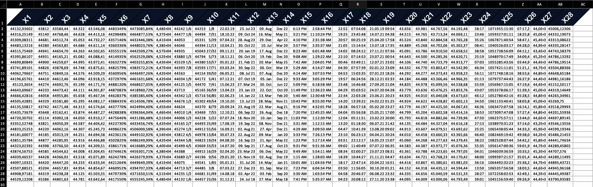

```{r setup, include = FALSE}
library(openxlsx2)
options(rmarkdown.html_vignette.check_title = FALSE)
knitr::opts_chunk$set(
  collapse = TRUE,
  comment = "#>"
)
```

Welcome to the styling manual for `openxlsx2`. In this manual you will learn how to use `openxlsx2` to style your worksheets. data from xlsx-files to R as well as how to export data from R to xlsx, and how to import and modify these openxml workbooks in R.

# Styling showcase

## Colors, text rotation and number formats

Below we show you two ways how to create styled tables with `openxlsx2` one using the high level functions to style worksheet areas and one using the bare metal approach of creating the identical table. We show both ways to create styles in `openxlsx2` to show how you could build on our functions or create your very own functions.

```{r echo=FALSE, warning=FALSE, out.width="100%", fig.cap="The example below, with increased column width."}

```

### the quick way: using high level functions

```{r}
# add some dummy data
set.seed(123)
mat <- matrix(rnorm(28 * 28, mean = 44444, sd = 555), ncol = 28)
colnames(mat) <- make.names(seq_len(ncol(mat)))
border_col <- wb_color(theme = "1")
border_sty <- "thin"

# prepare workbook with data and formated first row
wb <- wb_workbook() %>%
  wb_add_worksheet("test") %>%
  wb_add_data("test", mat) %>%
  wb_add_border("test", "A1:AB1",
    top_color = border_col, top_border = border_sty,
    bottom_color = border_col, bottom_border = border_sty,
    left_color = border_col, left_border = border_sty,
    right_color = border_col, right_border = border_sty,
    inner_hcolor = border_col, inner_hgrid = border_sty
  ) %>%
  wb_add_fill("test", "A1:AB1", color = wb_color(hex = "FF334E6F")) %>%
  wb_add_font("test", "A1:AB1", name = "Arial", bold = "1", color = wb_color(hex = "FFFFFFFF"), size = "20") %>%
  wb_add_cell_style("test", "A1:AB1", horizontal = "center", textRotation = "45")

# create various number formats
x <- c(
  0, 1, 2, 3, 4, 9, 10, 11, 12, 13, 14, 15, 16, 17, 18, 19, 20, 21, 22,
  37, 38, 39, 40, 45, 46, 47, 48, 49
)

# apply the styles
for (i in seq_along(x)) {
  cell <- sprintf("%s2:%s29", int2col(i), int2col(i))
  wb <- wb_add_numfmt(wb, "test", cell, x[i])
}

# wb$open()
```

### the long way: using bare metal functions
```{r}
# create workbook
wb <- wb_workbook()
wb <- wb_add_worksheet(wb, "test")

# add some dummy data to the worksheet
set.seed(123)
mat <- matrix(rnorm(28 * 28, mean = 44444, sd = 555), ncol = 28)
colnames(mat) <- make.names(seq_len(ncol(mat)))
wb$add_data("test", mat, colNames = TRUE)

# create a border style and assign it to the workbook
black <- c(rgb = "FF000000")
new_border <- create_border(
  bottom = "thin", bottom_color = black,
  top = "thin", top_color = black,
  left = "thin", left_color = black,
  right = "thin", right_color = black
)
wb$styles_mgr$add(new_border, "new_border")


# create a fill style and assign it to the workbook
new_fill <- create_fill(patternType = "solid", fgColor = wb_color(hex = "FF334E6F"))
wb$styles_mgr$add(new_fill, "new_fill")

# create a font style and assign it to the workbook
new_font <- create_font(sz = "20", name = "Arial", b = "1", color = wb_color(hex = "FFFFFFFF"))
wb$styles_mgr$add(new_font, "new_font")

# create a new cell style, that uses the fill, the font and the border style
new_cellxfs <- create_cell_style(
  numFmtId = "0",
  horizontal = "center",
  textRotation = "45",
  fillId = wb$styles_mgr$get_fill_id("new_fill"),
  fontId = wb$styles_mgr$get_font_id("new_font"),
  borderId = wb$styles_mgr$get_border_id("new_border")
)
# assign this style to the workbook
wb$styles_mgr$add(new_cellxfs, "new_styles")

# assign the new cell style to the header row of our data set
cell <- sprintf("A1:%s1", int2col(nrow(mat)))
wb_set_cell_style(wb, "test", cell, wb$styles_mgr$get_xf_id("new_styles"))

## style the cells with some builtin format codes (no new numFmt entry is needed)
# add builtin style ids
x <- c(
  "0", "1", "2", "3", "4", "9", "10", "11", "12", "13", "14", "15", "16",
  "17", "18", "19", "20", "21", "22", "37", "38", "39", "40", "45", "46",
  "47", "48", "49"
)

# create styles
new_cellxfs <- create_cell_style(numFmtId = x, horizontal = "center")

# assign the styles to the workbook
for (i in seq_along(x)) {
  wb$styles_mgr$add(new_cellxfs[i], paste0("new_style", i))
}

# new styles are 1:28
new_styles <- wb$styles_mgr$get_xf()
for (i in as.integer(new_styles$id[new_styles$name %in% paste0("new_style", seq_along(x))])) {
  cell <- sprintf("%s2:%s29", int2col(i), int2col(i))
  wb_set_cell_style(wb, "test", cell, i)
}

# assign a custom tabColor
wb$worksheets[[1]]$sheetPr <- xml_node_create(
  "sheetPr",
  xml_children = xml_node_create(
    "tabColor",
    xml_attributes = wb_color(hex = "FF00FF00")
  )
)

# # look at the beauty you've created
# wb_open(wb)
```

# Working with number formats

Per default `openxlsx2` will pick up number formats for selected R classes.

## numfmts
```{r}
## Create Workbook object and add worksheets
wb <- wb_workbook()
wb$add_worksheet("S1")
wb$add_worksheet("S2")

df <- data.frame(
  "Date" = Sys.Date() - 0:19,
  "T" = TRUE, "F" = FALSE,
  "Time" = Sys.time() - 0:19 * 60 * 60,
  "Cash" = paste("$", 1:20), "Cash2" = 31:50,
  "hLink" = "https://CRAN.R-project.org/",
  "Percentage" = seq(0, 1, length.out = 20),
  "TinyNumbers" = runif(20) / 1E9, stringsAsFactors = FALSE
)

## openxlsx will apply default Excel styling for these classes
class(df$Cash) <- c(class(df$Cash), "currency")
class(df$Cash2) <- c(class(df$Cash2), "accounting")
class(df$hLink) <- "hyperlink"
class(df$Percentage) <- c(class(df$Percentage), "percentage")
class(df$TinyNumbers) <- c(class(df$TinyNumbers), "scientific")

wb$add_data("S1", x = df, startRow = 4, rowNames = FALSE)
wb$add_data_table("S2", x = df, startRow = 4, rowNames = FALSE)
```


## numfmts2

In addition, you can set the style to be picked up using `openxlsx2` options.

```{r}
wb <- wb_workbook()
wb <- wb_add_worksheet(wb, "test")

options("openxlsx2.dateFormat" = "yyyy")
options("openxlsx2.datetimeFormat" = "yyyy-mm-dd")
options("openxlsx2.numFmt" = "€ #.0")

df <- data.frame(
  "Date" = Sys.Date() - 0:19,
  "T" = TRUE, "F" = FALSE,
  "Time" = Sys.time() - 0:19 * 60 * 60,
  "Cash" = paste("$", 1:20), "Cash2" = 31:50,
  "hLink" = "https://CRAN.R-project.org/",
  "Percentage" = seq(0, 1, length.out = 20),
  "TinyNumbers" = runif(20) / 1E9, stringsAsFactors = FALSE,
  "numeric" = 1
)

## openxlsx will apply default Excel styling for these classes
class(df$Cash) <- c(class(df$Cash), "currency")
class(df$Cash2) <- c(class(df$Cash2), "accounting")
class(df$hLink) <- "hyperlink"
class(df$Percentage) <- c(class(df$Percentage), "percentage")
class(df$TinyNumbers) <- c(class(df$TinyNumbers), "scientific")

wb$add_data("test", df)
```

```{r include=FALSE}
# cleanup
options("openxlsx2.numFmt" = NULL)
```

# Modifying the column widths

## wb_set_col_widths
```{r}
sheet <- "mtcars"
wb <- wb_workbook()
wb <- wb_add_worksheet(wb, sheet)
wb$add_data(sheet, mtcars, rowNames = TRUE)

cols <- 1:12
wb <- wb_set_col_widths(wb, sheet, cols = cols, widths = "auto")
wb
```

# Adding borders

## add borders
```{r}
wb <- wb_workbook()
# full inner grid
wb$add_worksheet("S1", gridLines = FALSE)$add_data(x = mtcars)
wb$add_border(
  dims = "A2:K33",
  inner_hgrid = "thin", inner_hcolor = c(rgb = "FF808080"),
  inner_vgrid = "thin", inner_vcolor = c(rgb = "FF808080")
)
# only horizontal grid
wb$add_worksheet("S2", gridLines = FALSE)$add_data(x = mtcars)
wb$add_border(dims = "A2:K33", inner_hgrid = "thin", inner_hcolor = c(rgb = "FF808080"))
# only vertical grid
wb$add_worksheet("S3", gridLines = FALSE)$add_data(x = mtcars)
wb$add_border(dims = "A2:K33", inner_vgrid = "thin", inner_vcolor = c(rgb = "FF808080"))
# no inner grid
wb$add_worksheet("S4", gridLines = FALSE)$add_data(x = mtcars)
wb$add_border("S4", dims = "A2:K33")
```


## styled table

Below we show you two ways how to create styled tables with `openxlsx2` one using the high level functions to style worksheet areas and one using the bare metal approach of creating the identical table.

```{r echo=FALSE, warning=FALSE}
knitr::include_graphics("img/styled_table.jpg")
```

### the quick way: using high level functions
```{r}
# add some dummy data to the worksheet
mat <- matrix(1:4, ncol = 2, nrow = 2)
colnames(mat) <- make.names(seq_len(ncol(mat)))

wb <- wb_workbook() %>%
  wb_add_worksheet("test") %>%
  wb_add_data(x = mat, colNames = TRUE, startCol = 2, startRow = 2) %>%
  # center first row
  wb_add_cell_style(dims = "B2:C2", horizontal = "center") %>%
  # add border for first row
  wb_add_border(
    dims = "B2:C2",
    bottom_color = c(theme = "1"), bottom_border = "thin",
    top_color = c(theme = "1"), top_border = "double",
    left_border = "", right_border = ""
  ) %>%
  # add border for last row
  wb_add_border(
    dims = "B4:C4",
    bottom_color = c(theme = "1"), bottom_border = "double",
    top_border = "", left_border = "", right_border = ""
  )
```

### the long way: creating everything from the bone
```{r}
# add some dummy data to the worksheet
mat <- matrix(1:4, ncol = 2, nrow = 2)
colnames(mat) <- make.names(seq_len(ncol(mat)))

wb <- wb_workbook()
wb <- wb_add_worksheet(wb, "test")

wb$add_data("test", mat, colNames = TRUE, startCol = 2, startRow = 2)

# create a border style and assign it to the workbook
black <- c(rgb = "FF000000")
top_border <- create_border(
  top = "double", top_color = black,
  bottom = "thin", bottom_color = black
)

bottom_border <- create_border(bottom = "double", bottom_color = black)

wb$styles_mgr$add(top_border, "top_border")
wb$styles_mgr$add(bottom_border, "bottom_border")

# create a new cell style, that uses the fill, the font and the border style
top_cellxfs <- create_cell_style(
  numFmtId = "0",
  horizontal = "center",
  borderId = wb$styles_mgr$get_border_id("top_border")
)
bottom_cellxfs <- create_cell_style(
  numFmtId = "0",
  borderId = wb$styles_mgr$get_border_id("bottom_border")
)

# assign this style to the workbook
wb$styles_mgr$add(top_cellxfs, "top_styles")
wb$styles_mgr$add(bottom_cellxfs, "bottom_styles")

# assign the new cell style to the header row of our data set
cell <- "B2:C2"
wb_set_cell_style(wb, "test", cell, wb$styles_mgr$get_xf_id("top_styles"))
cell <- "B4:C4"
wb_set_cell_style(wb, "test", cell, wb$styles_mgr$get_xf_id("bottom_styles"))
```

### Use workbook colors and modify them

The loop below will apply the tint attribute to the fill color

```{r echo=FALSE, warning=FALSE, out.width="100%", fig.cap="Tint variations of the theme colors."}
knitr::include_graphics("img/color_tint.jpg")
```

```{r}
wb <- wb_workbook() %>% wb_add_worksheet("S1")

tints <- seq(-0.9, 0.9, by = 0.1)

for (i in 0:9) {
  for (tnt in tints) {
    col <- paste0(int2col(i + 1), which(tints %in% tnt))

    if (tnt == 0) {
      wb <- wb %>% wb_add_fill(dims = col, color = wb_color(theme = as.character(i)))
    } else {
      wb <- wb %>% wb_add_fill(dims = col, color = wb_color(theme = as.character(i), tint = tnt))
    }
  }
}
```

### Copy cell styles

It is possible to copy the styles of several cells at once. In the following example, the styles of some cells from a formatted workbook are applied to a previously empty cell range. Be careful though, `wb_get_cell_style()` returns only some styles, so you have to make sure that the copy-from and copy-to dimensions match in a meaningful way.

```{r}
wb <- wb_load(system.file("extdata", "oxlsx2_sheet.xlsx", package = "openxlsx2")) %>%
  wb_set_cell_style(1, "A30:G35", wb_get_cell_style(., 1, "A10:G15"))
# wb_open(wb)
```
